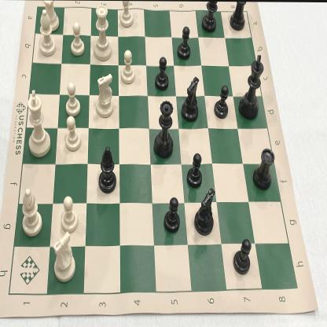
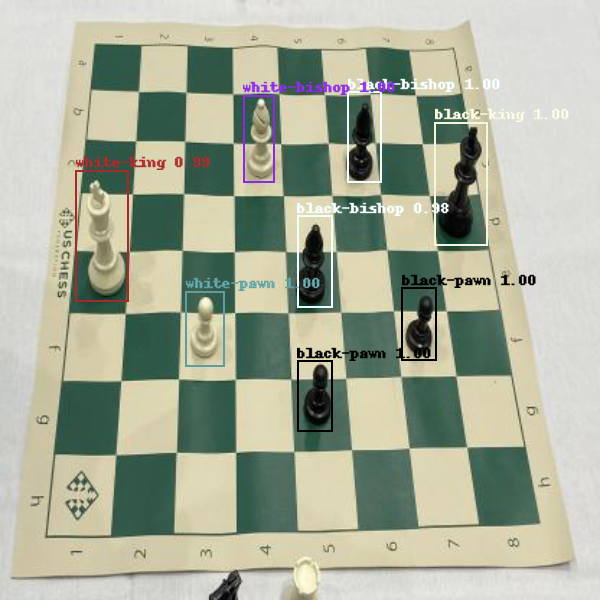
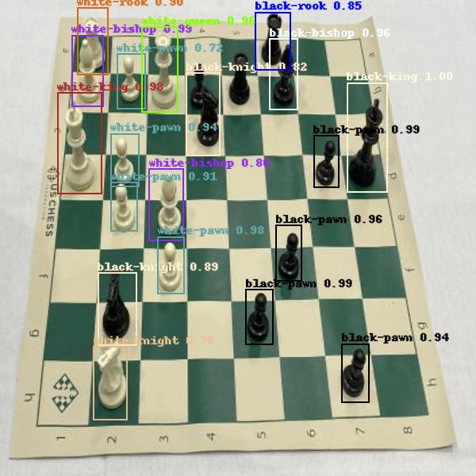

# Faster R-CNN in TensorFlow 2 w/ Keras

## Overview

This project aims to detect and classify Chess Pieces on a Chess Board.

My final results using the Roboflow Chess Pieces Dataset. Convergence is achieved in 30 epochs (at a learning rate of 0.001). We have used a VGG-16 backbone as the feature extractor.

| Class        | Precision (%) |
| ------------ | ------------- |
| black-king   | 100.0         |
| black-queen  | 92.9          |
| black-rook   | 99.0          |
| black-bishop | 95.9          |
| black-knight | 99.8          |
| black-pawn   | 96.6          |
| white-king   | 99.6          |
| white-queen  | 98.6          |
| white-rook   | 95.3          |
| white-bishop | 98.2          |
| white-knight | 99.7          |
| white-pawn   | 94.1          |
| **Mean**     | **97.47%**    |

You can see the full project report here: [ML Project Final Report](docs/ML-Project-Final-Report.pdf)

## Results
### Sample test image


A sample test input image that we used for predicting using our trained model.

### Prediction of a test image


In most of the test images, the prediction is accurate, and every piece was detected.

### When the predictions can wrong


In the above image some of the overlapping pieces, such as the black pawn and rook at B4 and B5 respectively (upper middle of the image) were not detected.

## Background Material

Required literature for understanding Faster R-CNN:

- [*Very Deep Convolutional Networks for Large-Scale Image Recognition*](docs/publications/vgg16.pdf) by Karen Simonyan and Andrew Zisserman. Describes VGG-16, which serves as the backbone (the input stage and feature extractor) of Faster R-CNN.
- [*Fast R-CNN*](docs/publications/fast_rcnn.pdf) by Ross Girshick. Describes Fast R-CNN, a significant improvement over R-CNN. Faster R-CNN shares both its backbone and detector head (the final stages that produce boxes and class scores) with Fast R-CNN.
- [*Faster R-CNN: Towards Real-Time Object Detection with Region Proposal Networks*](docs/publications/faster_rcnn.pdf) by Shaoqing Ren, Kaiming He, Ross Girshick, and Jian Sun. Faster R-CNN improves upon Fast R-CNN by introducing a network that computes the initial object proposals directly, allowing all stages -- feature extraction, proposal generation, and final object detection -- to be trained together end-to-end.

## Setup

Python 3.7 (for `dataclass` support) or higher is required. Dependencies for TensorFlow versions of the model are located in `requirements.txt`, respectively. Tensorflow 2.7.0 was used.

Instructions here are given for Linux systems.

### TensorFlow 2 Setup

The TensorFlow version does not require CUDA, although its use is highly advised to achieve acceptable performance. TensorFlow environment set up *without* CUDA is very straightforward. The included `requirements.txt` file should suffice.

```
python -m venv venv
source venv/bin/activate
pip install -r requirements.txt
```

Getting CUDA working is more involved and beyond the scope of this document. On Linux, I use an NVIDIA docker container and `tf-nightly-gpu` packages. On Windows, with CUDA installed, the ordinary `tensorflow` package should just work out of the box with CUDA support.


## Dataset

The dataset we used is the Roboflow Chess Pieces Recognition dataset available here: <https://public.roboflow.com/object-detection/chess-full>
All photos were captured from a constant angle, a tripod to the left of the board. The bounding boxes of all pieces are annotated as follows: white-king, white-queen, white-bishop, white-knight, white-rook, white-pawn, black-king, black-queen, black-bishop, black-knight, black-rook, black-pawn.
There are 2894 labels across 292 images for the raw version, and the updated version has 693 images.

## Pre-Trained Models and Initial Weights

To train the model, initial weights for the shared VGG-16 layers are required.

When training the TensorFlow version of the model from scratch and no initial weights are loaded explicitly, the Keras pre-trained VGG-16 weights will automatically be used.

## Running the Model

The TensorFlow model is run like this:
```
python -m frcnn
```

### Training the Model

Numerous training parameters are available. Defaults are set to be consistent with the original paper. Some hyperparameters, such as mini-batch sampling and various detection thresholds, are hard-coded and not exposed via the command line.

Replicating the paper results requires training with stochastic gradient descent (the default in the TensorFlow version) for 10 epochs at a learning rate of 0.001 and a subsequent 4 epochs at 0.0001. The default momentum and weight decay are 0.9 and 5e-4, respectively, and image augmentation via random horizontal flips is enabled.

We have many options for hyper-parameter tuning. Namely, a choice of optimizer (SGD or Adam), two RoI pooling implementations, and the option for the detector stage to output logits rather than probabilities. TensorFlow lacks an exact RoI pooling operation so by default, an approximation involving `tf.image.crop_and_resize` is used. A custom RoI pooling layer was implemented as a learning exercise but is too slow for practical use. When loading saved weights, make sure to set options consistently.

### Running Predictions

There are three ways to run predictions on images:

1. `--predict`: Takes a URL (local file or web URL), runs prediction, and displays the results.
2. `--predict-to-file`: Takes a URL, runs prediction, and writes the results to an image file named `predictions.png`.
3. `--predict-all`: Takes a training split from the dataset (e.g., `test`, `train`, etc.) and runs prediction on all images within it. Writes each image result to a directory named after the split (e.g., `predictions_test/`, `predictions_train/`).

Examples of each:

```
python -m frcnn --load-from=saved_weights.h5 --predict-to-file=image.png
python -m frcnn --load-from=saved_weights.h5 --predict-all=test
```
